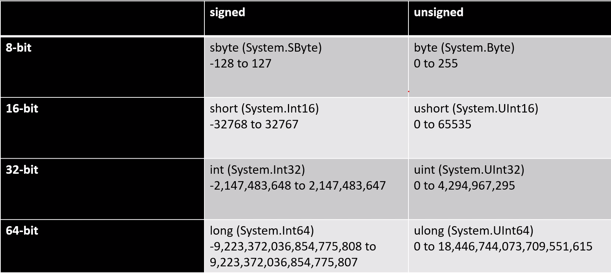

# Numerics Section Cheat Sheet

## Integral Types and Limits


## Integer specifics
- Each data type has a minimum and maximum value
	- E.g., `int.MinValue`, `long.MaxValue`
- Conversion functions from strings
	- `int value = int.Parse("123"); ` throws on invalid string
	- `bool success = int.TryParse("123", out int value)` returns false if failed
	- These are often hand-optimized in performance-critical scenarios
- default(T) returns 0 for all types 

## Overflow
- A situation where you need more bits than are available is called an `overflow`
- Example: adding 1 to the largest number, or subtracting 1 from the smallest
- Compile-time error:
	- var x = int.MinValue - 1;
	- eror CS0220: The operation overflows at compile time in checked mode
Run-time behavior:
	- Not handled by default, you get 'garbage' value 

## Division by Zero 
- Compile-time error
	- `var x = 1/0;`
	- error CS0020: Division by constant zero
- Run-time exception
	- var zero = 0; 
	- var x = 1/zero;
	- `System.DivideByZeroException`: Attempted to divide by zero. 
- Division by zero with integers is a problem
	- No bit state to represent a 'special value'
	- Thus, division by zero is simply not allowed anywhere

## Checked and Unchecked 
- Checked mode = please be sure to check this for me
- Unchecked mode = please don't check this, I take responsability 
- These scopes only affect overflow; they do not affect division by zero 
- Division by zero will always throw

## Overflow and Checked 
- By default, overflow is disallowed at compile-time (if found) and is totally allowed at runtime
- We can reverse both of these situations
- Allow obvious overflow at compile-time:
```c#
unchecked { 
	var n = int.MinValue - 1;
}
```
- This will compile just fine
- Detect overflow at runtime 
```c#
checked {
	try {
		int x2 = int.MinValue - 1;
	} catch(OverflowException e ){
		Console.WriteLine(e.Message);
	}

}
```


## Detect Overflow Everywhere 


- There is no `auto-vectorization` free lunch. 
- Use intrinsics for low-level control
	- Easy if you control hardware
	- Very tedious if you don't know what CPU you'll be running on 
- Use SIMD-enabled types 
	- `Vector<T>` adapts to architecture
	- Supports non-accelerated execution
- You can combine SIMD and multithreading
- GPGPU is likely to trump CPU SIMD calculations on non-divergent streamable loads 
	- But GPUs are not programmable in C# 
	- Very difficult to write GPU-neutral code 
You can combine SIMD/multicore with GPGPU for more power

## Vector<T> Scenario 
- I want to add two arrays of bytes
- Create and initialize arrays 
```c#
byte[] array1, array2, result;
```
- Determine how many fit into a `Vector<byte>`
- Loop by register size
- Use vector as a view into an array 

```c#
byte[] array1 = Enumerable.Range(1, 128).Select(x => (byte) x).ToArray()
byte[] array2 = Enumberable.Range(4, 128).Select(x => (byte) x).ToArray()
byte[] result = new byte[128];

int size = vector<byte>.Count;

for(int i = 0; i < array1.Length; i += size)
{
	var va = new vector<bytes>(array1, i);
	var vb = new vector<bytes>(array2, i);
	var vbresult = va + vb;
	vresult.CopyTo(result, i);
}

```